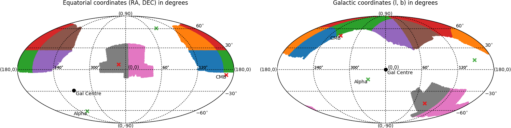

# README

## Description

To be added...

## Requirements
The software was written to work with `python 3`. 

**Python modules used:**

- mpl_toolkits
- matplotlib
- astropy
- numpy
- sys

## Usage

`python sky_plot.py list_of_files_with_coordinates [--option]`

#### Options:

--gal - coordinates in the files are l and b galactic coordinates. 

--eq  - coordinates in the files are RA and DEC equatorial coordinates.

One of the two options above must be specified.

--transp - Add transparency to points to mimic a density map.

--ham - Use [Hammer](https://matplotlib.org/basemap/users/hammer.html) projection. Otherwise, [Mollweide](https://matplotlib.org/basemap/users/moll.html) projection is used.

--save - Save figure in a file.

## Examples

Single patch (one list specified) with transparency:

Multiple patches (8 lists specified) with no transparency:

